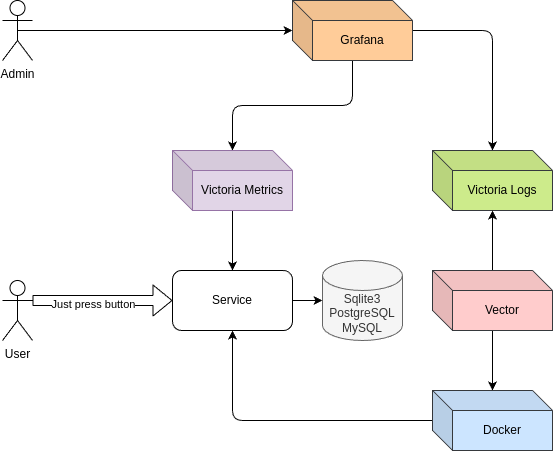

# Baton nagimator

> _Нажатия на кнопку стали еще вкусней, теперь со вкусом туду листа_
>
> _Нажать на кнопку не сложнее чем завести тудушку_
>
> _Не стоит жать на кнопки что не считают свои нажатия_
>
> _Узнай когда нажимал_
>
> _Прожми BFF_
>
> _Любая база на вкус, и пофиг что медленно_
>
> _Самый маленький монолит_

## Как запустить

Просто локально

> make run

Готовый пример в докере

> make up

После запуска в докере

- [Service](http://localhost:8080/)
- [Grafana](http://localhost:3000/)
- [VictoriaMetrics](http://localhost:8428/)
- [VictoriaLogs](http://localhost:9428/)

## Схема примера

## Другие кнопочные

- [Petus projectus](https://github.com/gbh007/petus-projectus)
- [Buttoners](https://github.com/gbh007/buttoners)

_Серьезно, ты же не ожидал что этот проект серьезный?_
